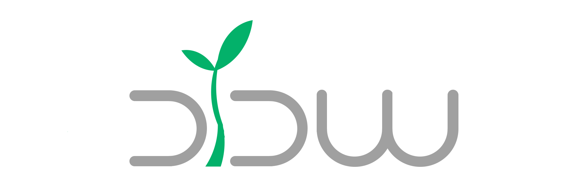

# Dynamic Data Management

 [](https://github.com/facebook/react) [](http://opensource.org/licenses/MIT) [](https://reactjs.org/docs/how-to-contribute.html#your-first-pull-request)


## 介绍
DDM(Dynamic Data Management)动态数据管理平台

## 部署
```
```
## 更多
egg+dva+antd+roadhog 框架文档地址
* [egg](https://eggjs.org/zh-cn/)
* [dva](https://dvajs.com/guide/)
* [antd](https://ant.design/index-cn)
* [roadhog](https://www.npmjs.com/package/roadhog)

# coding
